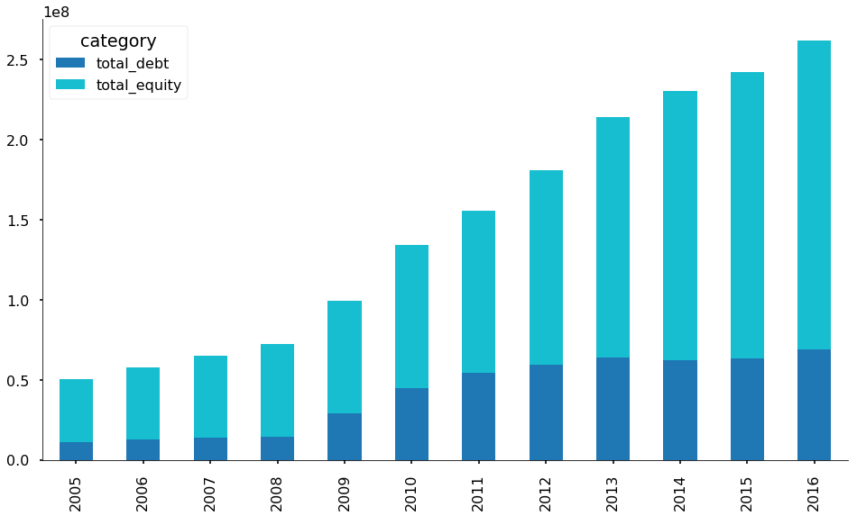
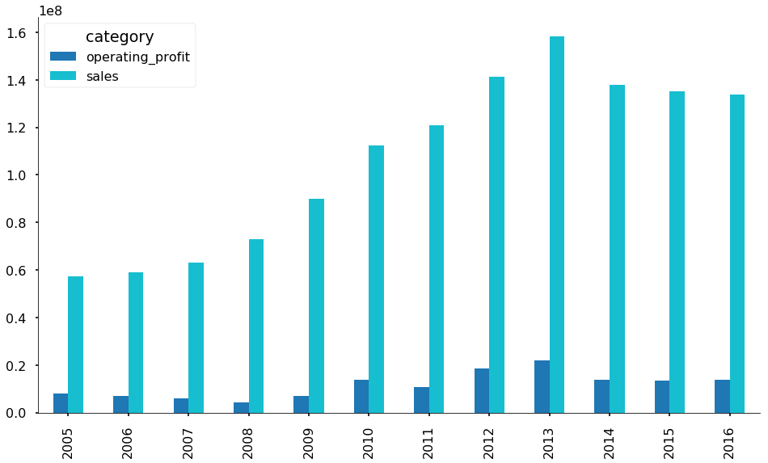

# [전자공시시스템](http://dart.fss.or.kr/) 크롤링으로 한 회사의 역대 사업보고서 다운받기 및 트렌드 확인하기
전자공시시스템에서 한 회사의 역대 사업보고서를 한 번에 다운받는 script입니다.

Update: 신규로 추가된 [dart_xls.ipynb](https://github.com/seoweon/dart_reports/blob/master/dart_xlsx.ipynb)를 통해 다운받은 사업보고서의 연도별 총 자본ㆍ부채 규모 및 매출ㆍ영업이익 현황을 빠르게 확인할 수 있습니다. 

## Directions: 

1. 다음 repository를 클론합니다
2. (아직 없다면) [DART API Key 발급페이지](http://dart.fss.or.kr/dsap001/apikeyManagement.do;jsessionid=Bs7AWiSzD8YmbBx0Zg3WoEixviKFJ7tL2OmeavY5lXpuYNh4MBmNjvvrgldaazhx.dart2_servlet_engine2)에 접속해 API key를 발급받습니다 (쉬워요)
3. 동 폴더에 ```api_key.txt```라는 텍스트파일을 만들어 발급받은 KEY를 저장합니다
4. [dart_crawling.ipynb](https://github.com/seoweon/dart_reports/blob/master/dart_crawling.ipynb)를 Jupyter Notebook에서 열어 실행시킵니다
5. 회사명 등의 입력사항을 넣으면 파일이 다운로드 됩니다
6. [dart_xls.ipynb](https://github.com/seoweon/dart_reports/blob/master/dart_xlsx.ipynb)를 Jupyter Notebook에서 열어 실행시킵니다
7. 앞서 다운받은 회사의 사업보고서 중 하나를 선택해 회사명을 입력합니다
8. "재무제표 크롤링"을 통해 연도별 총 자본ㆍ부채 규모 그래프를 확인할 수 있습니다 (아래는 삼성전자 예시)

9. "손익계산서 크롤링"을 통해 연도별 매출ㆍ영업이익 현황을 확인할 수 있습니다 (아래는 삼성전자 예시)


### 참고한 블로그
* http://quantkim.blogspot.kr/2018/01/dart-api-with.html
* http://tariat.tistory.com/31
* https://woosa7.github.io/fss_dart/

### Disclaimer:
* [dart_xls.ipynb](https://github.com/seoweon/dart_reports/blob/master/dart_xlsx.ipynb)는 어느수준 정형화된 엑셀 데이터를 크롤링한 것이기 때문에 버그가 있을 수 있습니다. 해 봤는데 안 되는 회사명이 있으면 알려주세요! 조사해보고 코드를 업데이트하도록 하겠습니다
* 이에 더불어, error-handling을 완벽하게 하지 않았기 때문에 코드 자체에서 에러가 나오지 않더라도 틀린 데이터를 가져오는 경우가 있을 수 있습니다. 이 부분도 보이는 대로 알려주세요


### 추신: 
* Regular Expressions를 사용하면 ```dm_no```같은 변수를 찾거나 폴더명을 정렬하는 게 좀 더 간편할 것 같아요.
* 사업보고서는 코드가 A001인데, 이것 외에도 다운받을 수 있는 공식 문서들이 굉장히 많습니다 (홈페이지의 [API 개발가이드](http://dart.fss.or.kr/dsap001/guide.do) 중 "상세 유형" 보면 이것저것 많이 나와있어요). 근데 어떤 방식으로 다운 받는 게 목적에 부합할 지 확신이 안 서서 우선은 사업보고서만 다운받는 형식으로 구성했습니다
* ~~다음 단계는 다운받은 사업보고서 pdf를 크롤링해서 재무제표 같은 자료를 한 눈에 정리하거나, 아니면 어떤 analytics를 적용하는 건데, 생각을 좀 해봐야겠습니다~~
