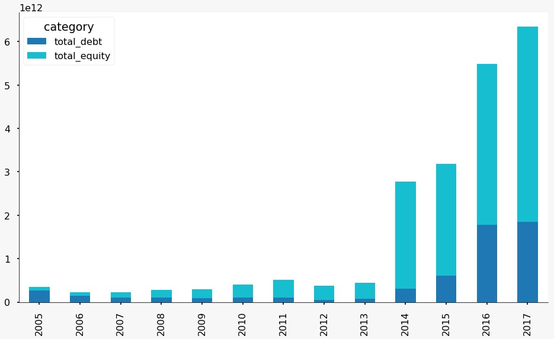
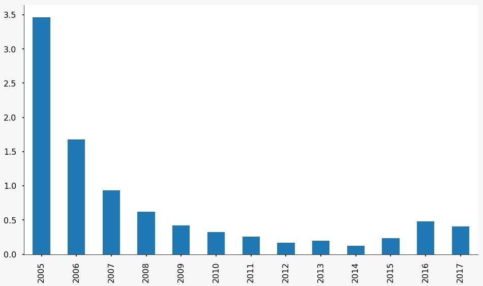
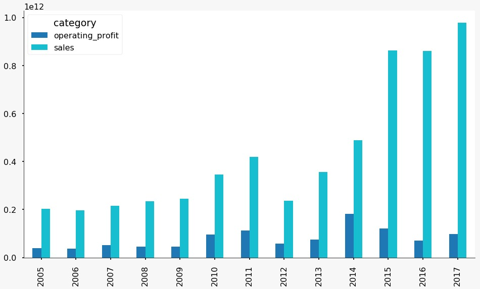
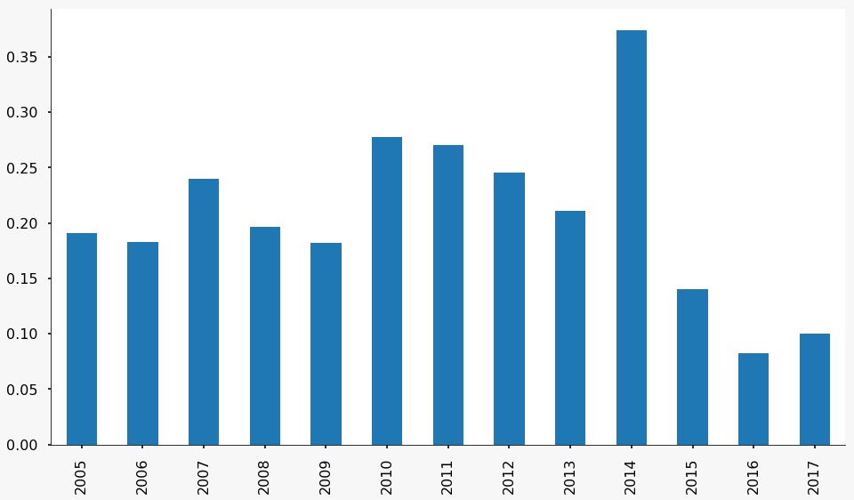

# Downloading and analyzing historical annual reports through crawling [DART](http://dart.fss.or.kr/) (Repository of Korea's Corporate Filings)

[한글 Readme를 보려면 여기를 클릭하세요](https://github.com/seoweon/dart_reports/blob/master/README.md#%EC%A0%84%EC%9E%90%EA%B3%B5%EC%8B%9C%EC%8B%9C%EC%8A%A4%ED%85%9C-%ED%81%AC%EB%A1%A4%EB%A7%81%EC%9C%BC%EB%A1%9C-%ED%95%9C-%ED%9A%8C%EC%82%AC%EC%9D%98-%EC%97%AD%EB%8C%80-%EC%82%AC%EC%97%85%EB%B3%B4%EA%B3%A0%EC%84%9C-%EB%8B%A4%EC%9A%B4%EB%B0%9B%EA%B8%B0-%EB%B0%8F-%ED%8A%B8%EB%A0%8C%EB%93%9C-%ED%99%95%EC%9D%B8%ED%95%98%EA%B8%B0)

Update: Debt-to-equity ratio and operating margin graphs are added to the analysis code in [dart_xls.ipynb](https://github.com/seoweon/dart_reports/blob/master/dart_xls.ipynb). 

## Directions: 
1. Clone this repository
2. Download the needed libraries through running [requirements.txt](https://github.com/seoweon/dart_reports/blob/master/requirements.txt) (type ```pip install -r requirements.txt``` in your command prompt and run)
	- If for some reason this doesn't work and an error occurs, try [requirements_full.txt](https://github.com/seoweon/dart_reports/blob/master/requirements_full.txt) (```pip install -r requirements_full.txt```)
3. (If you didn't already) Get an API Key from DART by [going to this link](http://dart.fss.or.kr/dsap001/apikeyManagement.do;jsessionid=Bs7AWiSzD8YmbBx0Zg3WoEixviKFJ7tL2OmeavY5lXpuYNh4MBmNjvvrgldaazhx.dart2_servlet_engine2) and following their directions
4. In the same folder that you cloned, add a simple text file with the given key and name it ```api_key.txt```
5. Open [dart_crawling.ipynb](https://github.com/seoweon/dart_reports/blob/master/dart_crawling.ipynb) on Jupyter Notebook and run the code
6. Input the information as directed (items such as company name). Running this code will download all annual reports for the given company and organize them neatly in folders
7. Open [dart_xls.ipynb](https://github.com/seoweon/dart_reports/blob/master/dart_xls.ipynb) on Jupyter Notebook and run the code
8. Select a company that you downloaded annual reports for already
9. You can check a company's total debt and equity trend as well as their debt-to-equity ratio trend over the years
10. You can check a company's total operating profit and sales as well as their operating margin trend over the years

Below are example charts using [Kakao corporation](https://www.kakaocorp.com/?lang=en)'s data:
#### Kakao total debt and equity trend:

#### Kakao debt-to-equity ratio: 

#### Kakao operating profit and sales:

#### Kakao operating margin:


### Blogs I referred to for making this
* http://quantkim.blogspot.kr/2018/01/dart-api-with.html
* http://tariat.tistory.com/31
* https://woosa7.github.io/fss_dart/

### Disclaimer:
* [dart_xls.ipynb](https://github.com/seoweon/dart_reports/blob/master/dart_xls.ipynb) is not 100% foolproof because the formatting of balance sheets are slightly different from company to company. If you discover a company that doesn't work, please let me know by raising an issue and I will look into fixing it as soon as I can.
* In addition, since error-handling is not perfect either, there may be a chance that the code fails silently and doesn't tell you an error occurred. Also, please let me know if you discover this.

### Post-script: 
* Finding a variable called ```dm_no``` was not easy, and could be done better using RegEx. May get on this in the future. 
* We only look at annual reports in this code, but DART has many other types of corporate filings that could be interesting to look into. The homepage's own [API development guide](http://dart.fss.or.kr/dsap001/guide.do) demonstrates a wide variety of using their data, so this is only scratching the surface. 

# [전자공시시스템](http://dart.fss.or.kr/) 크롤링으로 한 회사의 역대 사업보고서 다운받기 및 트렌드 확인하기
전자공시시스템에서 한 회사의 역대 사업보고서를 한 번에 다운받는 script입니다.

Update: 부채비율 및 영업이익률 그래프 추가하였습니다. ([dart_xls.ipynb](https://github.com/seoweon/dart_reports/blob/master/dart_xls.ipynb))

## 사용방법: 

1. 다음 repository를 클론합니다
2. [requirements.txt](https://github.com/seoweon/dart_reports/blob/master/requirements.txt)를 이용해 필요한 라이브러리를 설치합니다. (```pip install -r requirements.txt```)
    - 만약 어떠한 이유로 계속 오류가 발생한다면 좀 더 강력한 조치로 [requirements_full.txt](https://github.com/seoweon/dart_reports/blob/master/requirements_full.txt)를 이용해 전체 라이브러리 설치를 시도해봅니다. 
3. (아직 없다면) [DART API Key 발급페이지](http://dart.fss.or.kr/dsap001/apikeyManagement.do;jsessionid=Bs7AWiSzD8YmbBx0Zg3WoEixviKFJ7tL2OmeavY5lXpuYNh4MBmNjvvrgldaazhx.dart2_servlet_engine2)에 접속해 API key를 발급받습니다 (쉬워요)
4. 동 폴더에 ```api_key.txt```라는 텍스트파일을 만들어 발급받은 KEY를 저장합니다
5. [dart_crawling.ipynb](https://github.com/seoweon/dart_reports/blob/master/dart_crawling.ipynb)를 Jupyter Notebook에서 열어 실행시킵니다
6. 회사명 등의 입력사항을 넣으면 파일이 다운로드 됩니다
7. [dart_xls.ipynb](https://github.com/seoweon/dart_reports/blob/master/dart_xls.ipynb)를 Jupyter Notebook에서 열어 실행시킵니다
8. 앞서 다운받은 회사의 사업보고서 중 하나를 선택해 회사명을 입력합니다
9. "재무제표 크롤링"을 통해 연도별 총 자본ㆍ부채 규모 그래프를 확인할 수 있습니다 
10. "손익계산서 크롤링"을 통해 연도별 매출ㆍ영업이익 현황을 확인할 수 있습니다 

아래는 [카카오](https://www.kakaocorp.com/?lang=ko) 데이터로 그린 그래프입니다:
#### 카카오 총부채 및 총 자산 추이:

#### 카카오 부채비율 추이: 

#### 카카오 영업이익 및 총매출 추이:

#### Kakao 영업이익률 추이:


### 참고한 블로그
* http://quantkim.blogspot.kr/2018/01/dart-api-with.html
* http://tariat.tistory.com/31
* https://woosa7.github.io/fss_dart/

### 주의사항:
* [dart_xls.ipynb](https://github.com/seoweon/dart_reports/blob/master/dart_xls.ipynb)는 어느수준 정형화된 엑셀 데이터를 크롤링한 것이기 때문에 버그가 있을 수 있습니다. 해 봤는데 안 되는 회사명이 있으면 알려주세요! 조사해보고 코드를 업데이트하도록 하겠습니다
* 이에 더불어, error-handling을 완벽하게 하지 않았기 때문에 코드 자체에서 에러가 나오지 않더라도 틀린 데이터를 가져오는 경우가 있을 수 있습니다. 이 부분도 보이는 대로 알려주세요


### 추신: 
* Regular Expressions를 사용하면 ```dm_no```같은 변수를 찾거나 폴더명을 정렬하는 게 좀 더 간편할 것 같아요.
* 사업보고서는 코드가 A001인데, 이것 외에도 다운받을 수 있는 공식 문서들이 굉장히 많습니다 (홈페이지의 [API 개발가이드](http://dart.fss.or.kr/dsap001/guide.do) 중 "상세 유형" 보면 이것저것 많이 나와있어요). 근데 어떤 방식으로 다운 받는 게 목적에 부합할 지 확신이 안 서서 우선은 사업보고서만 다운받는 형식으로 구성했습니다
